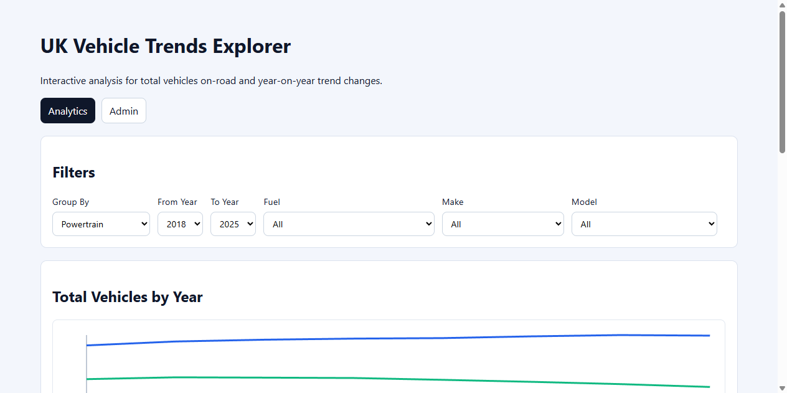
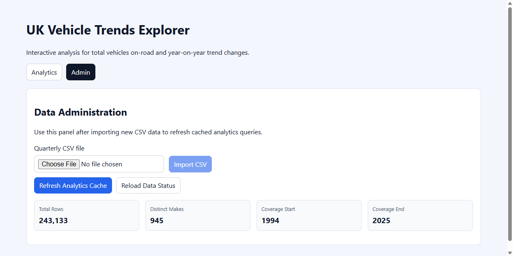

# UK Vehicle Data Analytics

This repository contains an end-to-end implementation for a UK vehicle analytics platform.

## Problem Statement

- create an interactive website that provides analysis of trends for vehicles currently on the road in the UK. This should be for both total number and year-on-year changes.
- Analysis should be mainly be in the form of graphs, but some textual highlights may also be appropriate.
- Users will want to look at trends between types of powertrain (Petrol/Diesel/Electric etc) and also manufacturers, models etc.
- We expect a high number of visitors to this public site, and you should plan accordingly.
- It should be easy to update the data that powers the site. Provide an admin area to do this.
- The site should be clutter free, look good, and be easy to use.

### Stretch Goals (Any Options)

- Option 1: User enters their current vehicle and the system suggests comparable vehicles in different powertrains to see how they are being adopted.
  - Example: I have a Skoda superb (petrol) how is that selling, and what are the top 10 popular comparable Size/power electric, diesel and other petrol models from other manufacturers, and how are they selling? Show a graph.
  - Example: “Show me the top 10 electric cars in 2024” or “Compare diesel vs electric adoption from 2020 to 2024.”
- Option 2: AI-Generated Insights (LLM Integration)
  - Use an LLM to generate textual summaries of trends based on the data.
  - Example: “Electric vehicles grew by X% year-on-year. Whist Petrol and Diesel fell sharply. Even Hybrids Stagnated with a drop of 1%”
- Option 3: Statistical analysis to predict trends for powertrains / make / models

## Implemented Solution

### Tech Stack

- Backend: Spring Boot 3, Java 17, JDBC/JPA, Flyway, Actuator, OpenAPI, Lombok
- Frontend: React + TypeScript + Vite
- Database: SQL Server
- Data source: UK vehicle quarterly CSV (`df_VEH0120_GB.csv`)

### Architecture

#### Backend Layers

- `controller`: API endpoints for analytics, admin, and users
- `service`: orchestration, caching, transformation, insights generation
- `repository`: SQL generation and query execution against `vehicles_data`
- `dto`: API contracts for trends, points, options, insights, admin status/import responses

#### Frontend Structure

- Single-page dashboard with two tabs:
  - `Analytics`: filters, trend line graph, YoY bars, textual highlights
  - `Admin`: CSV upload/import, cache refresh, data status summary

### Key Design Principles Used

- **Single Responsibility**: dedicated services/repositories/controllers
- **Open/Closed + Strategy**: `GroupByStrategy` for pluggable grouping dimensions
- **Separation of Concerns**: query construction isolated from API formatting
- **Defensive input handling**: validated year ranges, safe filter mapping, upload validation
- **Operational readiness**: actuator health endpoint, SQL logging for generated analytics queries

## Features Delivered

### Public Analytics

- Trend API for yearly totals with YoY change and YoY percent
- Filter options API for fuel, make, model
- Highlights API with textual summaries
- Grouping support:
  - `fuel`, `make`, `genModel`, `model`, `bodyType`, `licenceStatus`, `total`

### Admin Capabilities

- Data status API (`total rows`, `distinct makes`, year coverage)
- Cache refresh API
- CSV import API with multipart upload:
  - Validates CSV file type/content
  - Rebuilds `vehicles_data` schema from header
  - Batch inserts rows efficiently
  - Refreshes analytics metadata/cache automatically

### User CRUD (Foundational API Slice)

- User entity/repository/service/controller with:
  - list API (paging/sorting)
  - get, create, update, delete

## API Reference (Core)

### Analytics

- `GET /api/v1/analytics/trends`
- `GET /api/v1/analytics/highlights`
- `GET /api/v1/analytics/options`

### Admin

- `GET /api/v1/admin/data/status`
- `POST /api/v1/admin/data/refresh`
- `POST /api/v1/admin/data/import-csv` (multipart form-data, field: `file`)

### Health

- `GET /actuator/health`

Swagger:

- `http://localhost:8080/swagger-ui/index.html`

## Local Run

### 1) Start SQL Server (Docker)

```bash
docker compose up -d sqlserver
```

### 2) Backend

```bash
cd backend
./gradlew bootRun
```

### 3) Frontend

```bash
cd frontend
npm install
npm run dev
```

Frontend URL:

- `http://localhost:5173`

## UI Screenshots

### Analytics Dashboard



### Admin Data Management



## Data Import Workflow (Quarterly Update)

1. Open Admin tab in UI
2. Choose new quarterly CSV file
3. Click **Import CSV**
4. Wait for completion message
5. Verify status panel (rows, year range)

The import process updates `vehicles_data` and refreshes analytics caches/metadata.

## Performance & Scalability Considerations

- Cached analytics responses for repeated heavy trend requests
- Metadata cache for quarter-column discovery
- Batch database inserts for CSV import
- Server-side aggregation and filtering to avoid loading raw data into client

## Notable Compromises

- No authentication/authorization around admin endpoints yet
- No automated tests included in this pass (intentionally deferred for speed)
- Basic SVG charts implemented without external charting library
- CSV import is synchronous in-request (could be moved to background job for larger files)

## Recommended Next Improvements

- Add role-based access control for admin routes
- Add async import job tracking with progress and retries
- Add integration tests for analytics SQL generation and CSV import
- Add API pagination/top-N endpoints for very high-cardinality grouping
- Implement stretch goals (comparable alternatives, AI insights, forecasting)
